# Chu Pico - Chunithm Style Mini Controller

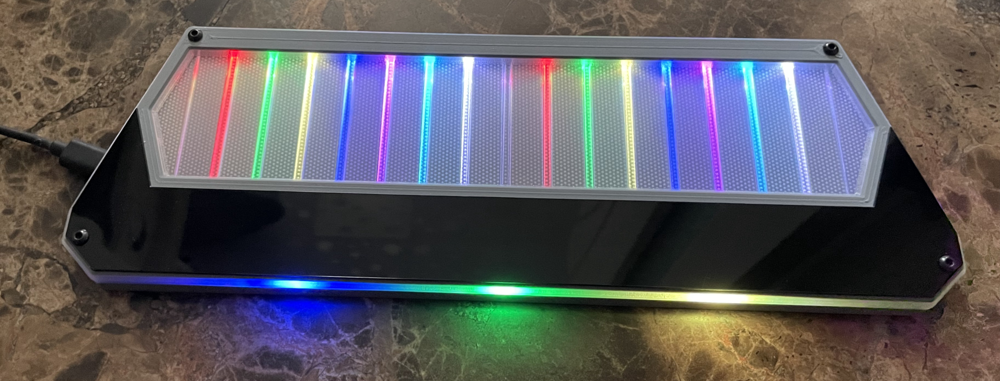

Features:
* It's small, made for 15-17 inch screen.
* Air towers are replaced with built-in ToF sensors.
* HID lights, of course!
* 32 keys (upper and lower rows).
* Follows CrazyRedMachine's RedBoard I/O protocol.
* Command line of rich features.
* All source files open.

Thanks to many respectful guys/companies who made their tools or materials free or open source (KiCad, OnShape, InkScape, Raspberry things).

And thanks to community developers that inspired me and helped me: CrazyRedMachine (https://github.com/CrazyRedMachine), SpeedyPotato (https://github.com/speedypotato).

## Notes
This one is relatively easy to build compared with my other projects like IIDX Pico or Teeny.

Also, you can check out my other cool projects.

* Popn Pico: https://github.com/whowechina/popn_pico  

* IIDX Pico: https://github.com/whowechina/iidx_pico  

* IIDX Teeny: https://github.com/whowechina/iidx_teeny  

This Chu Pico project:  
* Heavily depends on 3D printing, you need a Bambu 3D printer.
* Requires skills to solder tiny components.

## **Disclaimer** ##
I made this project in my personal time with no financial benefit or sponsorship. I will continue to improve the project. I have done my best to ensure that everything is accurate and functional, there's always a chance that mistakes may occur. I cannot be held responsible for any loss of your time or money that may result from using this open source project. Thank you for your understanding.

## About the License
It's CC-NC. So DIY for yourself and for your friend, don't make money from it.

## HOW TO BUILD
### PCB
* Go JLCPCB and make order with the gerber zip file (latest `Production\PCB\chu_main_xxx.zip`), regular FR-4 board, black color, thickness is **1.6mm**.  
* 1x Rasberry Pico Pi Pico or Pico W.  
  https://www.raspberrypi.com/products/raspberry-pi-pico
  Becareful of 3 pins that are at the other side, they're difficult to solder and may leave air bubbles.  
  

* 1x USB Type-C socket (918-418K2023S40001 or KH-TYPE-C-16P)
* 36x WS2812B-4020 side-facing RGB LEDs.  
  https://www.lcsc.com/product-detail/Light-Emitting-Diodes-LED_Worldsemi-WS2812B-4020_C965557.html
* TCA9548APWR (TSSOP-24) I2C multiplexer.  
  https://www.lcsc.com/product-detail/Signal-Switches-Encoders-Decoders-Multiplexers_Texas-Instruments-TCA9548APWR_C130026.html
* 3x MPR121 modules, there're many types in the market, choose ones like this, and remember to **cut (unshort) the ADDR pin** which is short by default.    
  https://www.sparkfun.com/products/retired/9695  
  There's not enough space for the whole height of MPR121 module plus the lead pads. So you need to solder the module like the picture shows below.  
  First apply some insulation tape.  
  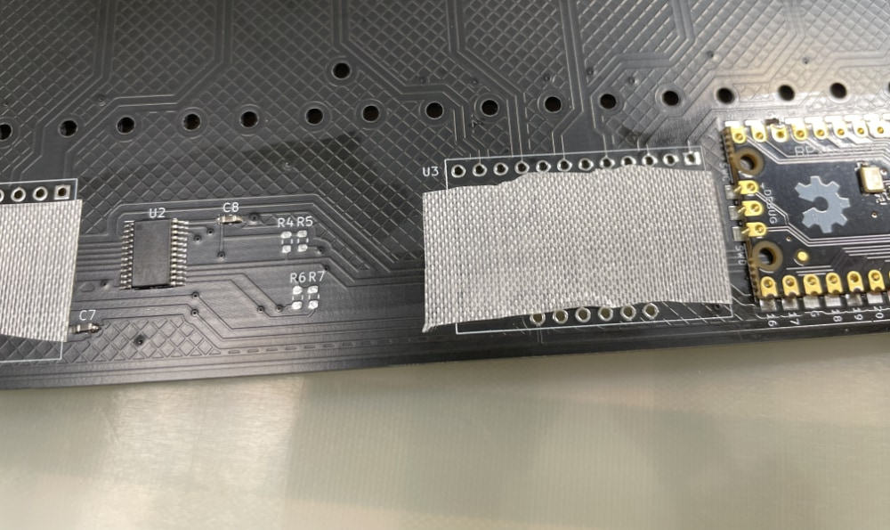  
  Then solder the module directly against the PCB.  
  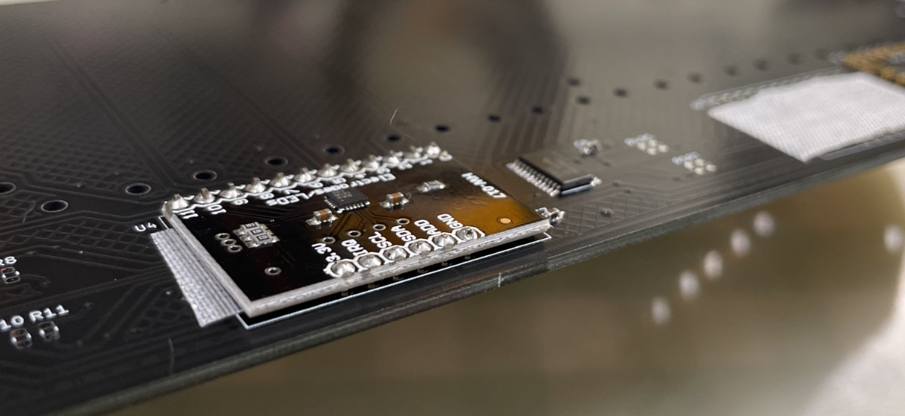  
  You can use the pins comes with the module, but you need to cut away the plastic pads.  
  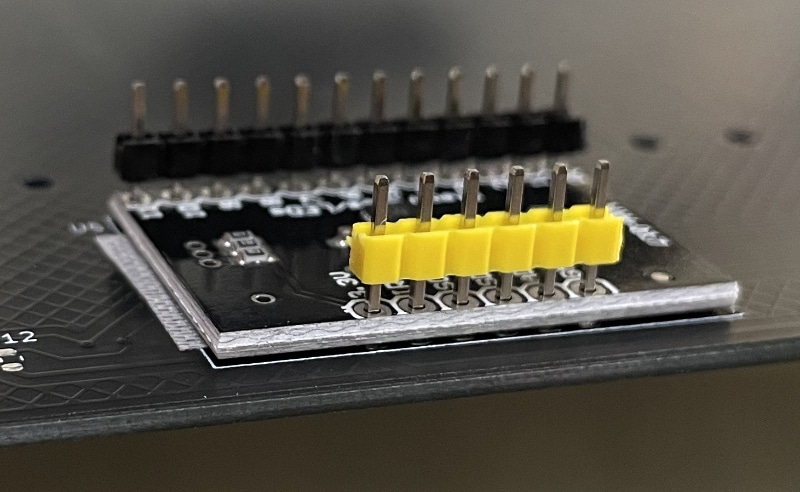
* 5x Sharp GP2Y0E03 ToF sensors, buy ones that equipped with cables.  
  https://www.lcsc.com/product-detail/Angle-Linear-Position-Sensors_Sharp-Microelectronics-GP2Y0E03_C920270.html
  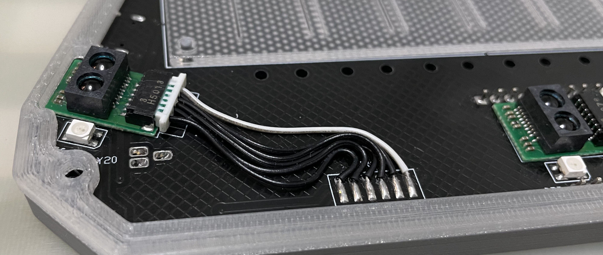
* 2x 0603 5.1kohm resistors (R1, R2) for USB.
* 1x SN74LV1T34DBVR (SOT-23-5) level shifter (U8), if you can't find one, use a 0603 10ohm resistor (R3) as an alternative.  
  https://www.lcsc.com/product-detail/Buffer-Driver-Transceiver_Texas-Instruments-SN74LV1T34DBVR_C100024.html

  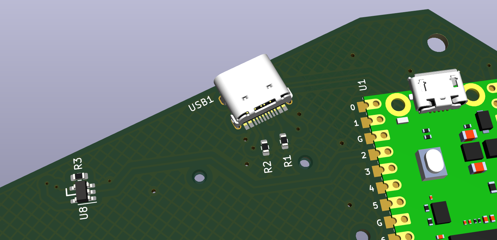

* 8x 0603 1uF (0.1~1uF all fine) capacitors (C1 to C8), OPTIONAL, recommended.
* 10x 0603 5.1kohm (1~10kohm all fine) resistors (R4 to R13) for I2C pull-up, required for overclock I2C.

### Light Guide Panel
* Find a service to cut a light guide panel using DXF or DWG file `Production\CAD\chu_pico_lgp.*`, the size is 256mm*60mm, 1.8mm to 2.0mm thickness, thinner is better for sensitivity. 2.0mm is easy to find, 1.8mm is rare. I used 1.8mm for my build.  
  
* LGP material choices:
  * Real LGP (Light Guide Panel) material, it's the best choice.  
    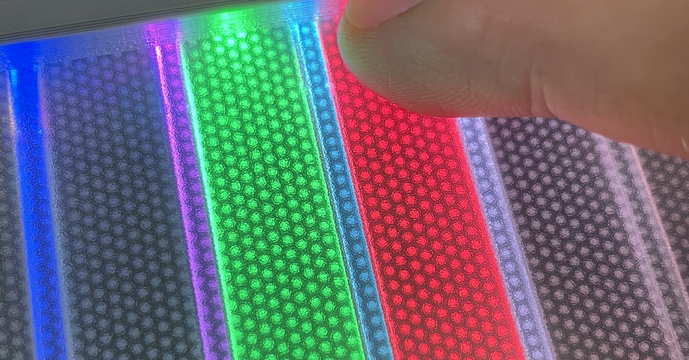
  * Clear Acrylic with Light Guide Film, it's a good choice.  
    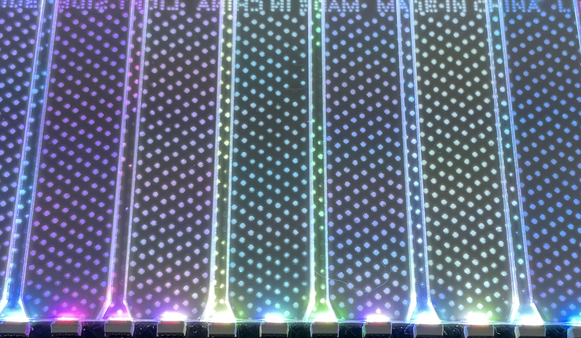
  * Clear Acrylic with single-side-frosted, it's a good choice.  
    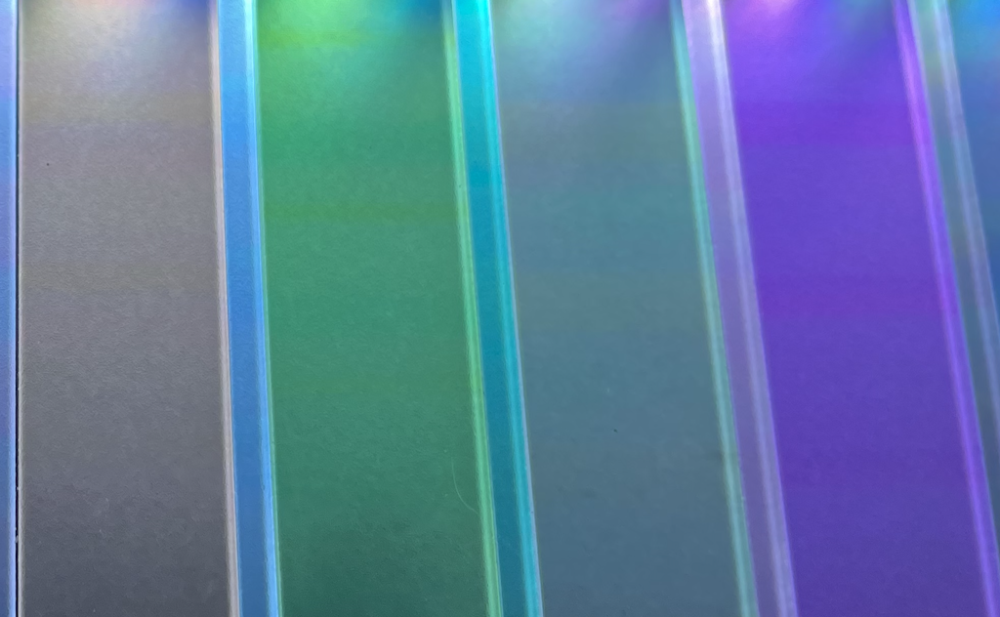
  * Clear Acrylic with manual single-side-sanding, it can work too.  
    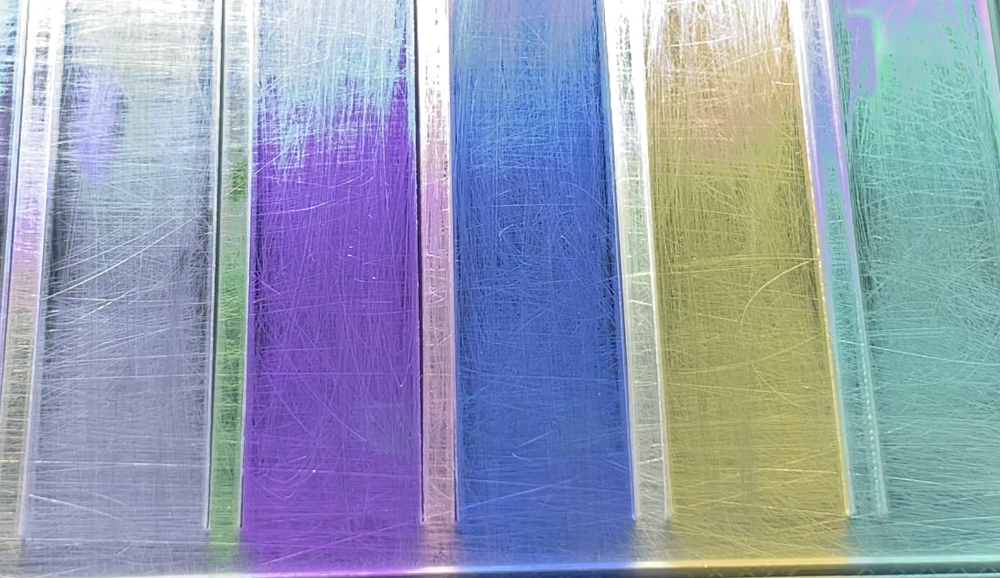

### Panel Film
* A self-adhesive **textured**/**frosted** film sheet, it is applied on top surface of the light guide panel. It improves touch feel. You can use window sticker film. It **MUST** be self-adhesive ones, **NOT** static cling ones. They're usually very cheap.
* Cut the film to roughly match the shape of the light guide panel, and stick to the panel.  
  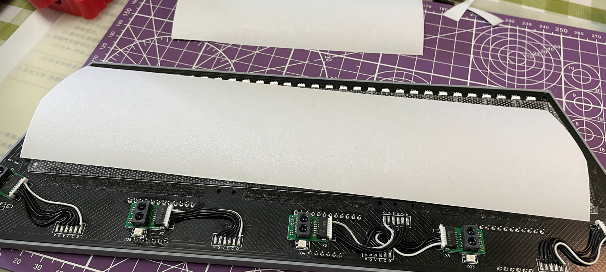
* Gentlely rub the film to remove any air bubbles and make it stick tightly.  
  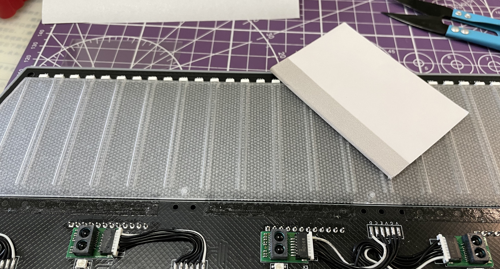

###  IR Cover
* It's for good looking, as it hides 5 ToF sensors.   
  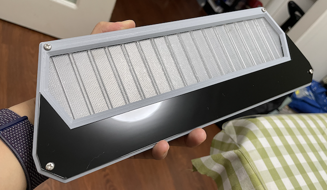
* IR lights can go through.  
  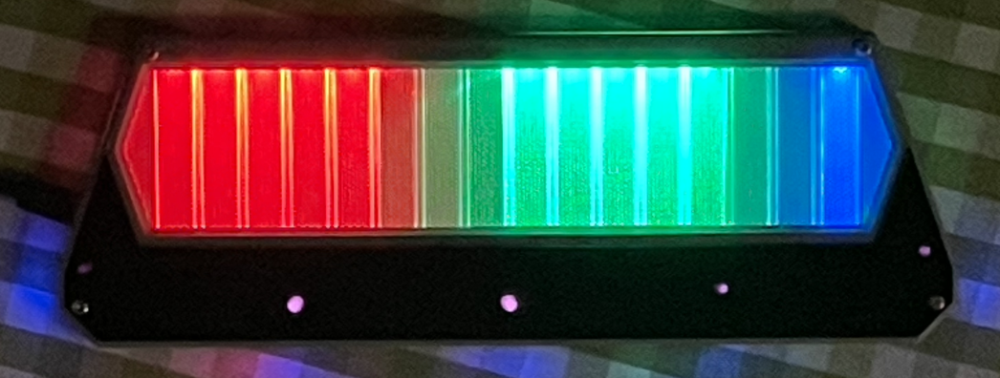
* Find a service to cut an IR cover using the DXF or DWG file `Production\CAD\chu_pico_ir_cover.*`, the size is 293.2mm*63.5mm, 1mm thickness. The material must be "Infrared Transmitting Acrylic Sheet" which can block visible lights (so it looks black) while letting IR lights go through.  
  
* If you can't find one, cut a regular smooth surface acrylic, but it can't hide the ToF sensors which are not good looking.

### 3D Printing
* You need a Bambu 3D printer for 2 reasons:
  * Parts are designed to perfectly fit in its 256mm*256mm print bed.
  * Its AMS system works great for easy-to-remove support material.
* For all the following prints:
  * To fit object in the bed, Z rotate: 315 degree, X, Y move to: 134mm  
  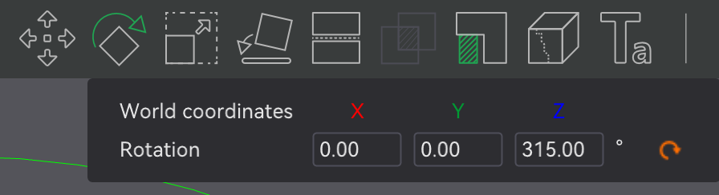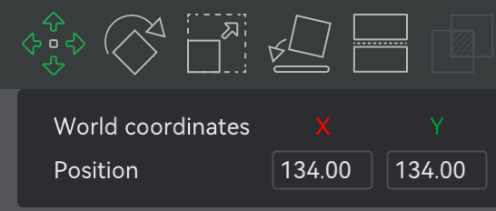  
  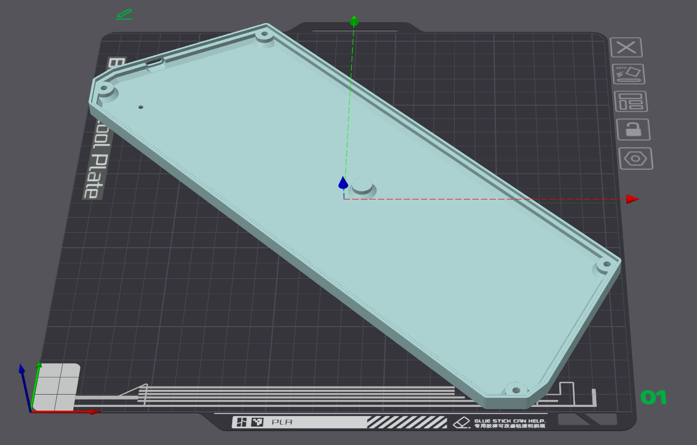
  
  * PLA, PETG, ABS are all OK.
  * Layer height: 0.2mm
  * 4-6 walls, 50+% infill
  * Support: Yes. If you have Bambu AMS system, use their special support material at interface layers.

* Base: `Production\3D\chu_pico_base.stl`, dark gray filament.
* Top Cover: `Production\3D\chu_pico_top_cover.stl`, dark gray filament.
* Cover Base: `Production\3D\chu_pico_cover_base.stl`, **clear transparent (IMPORTANT)** filament.
* Light Guide Panel Fixer: `Production\3D\chu_pico_lgp_fixer.stl`, color doesn't matter.

### Exploded View for Assembly
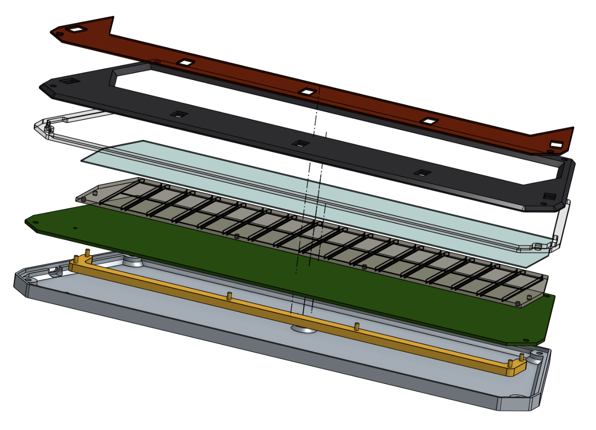

From top to bottom:
* IR Cover
* Top Cover
* Cover Base
* Panel Film
* Light Guide Panel
* PCB
* Light Guide Panel Fixer
* Base

You need **4x M3*12mm screws and 4x M3 hex nuts** to fix all things.

7x silicone anti-slip pads can be applied to the bottom side of the base to provide stability when playing.  
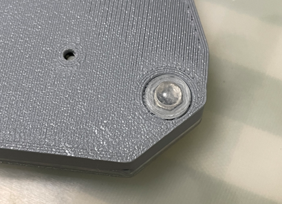

### Firmware
* UF2 file is in `Production\Firmware` folder.
* For the new build, hold the BOOTSEL button while connect the USB to a PC, there will be a disk named "RPI-RP2" showed up. Drag the UF2 firmware binary file into it. That's it. There's a small hole at the bottom side of the Chu Pico, it is facing right to the BOOTSEL button.
* It works on CrazyRedMachine's RedBoard protocol. For more information, please check out CrazyRedMachine's project (Don't forget to give him a star and drop by his GitHub for other cool projects):  
https://github.com/CrazyRedMachine/RedBoard
* It has a command line to do configuration. You can use this Web Serial Terminal to connect to the USB serial port of the Chu Pico. (Note: "?" is for help)  
  https://googlechromelabs.github.io/serial-terminal/  
  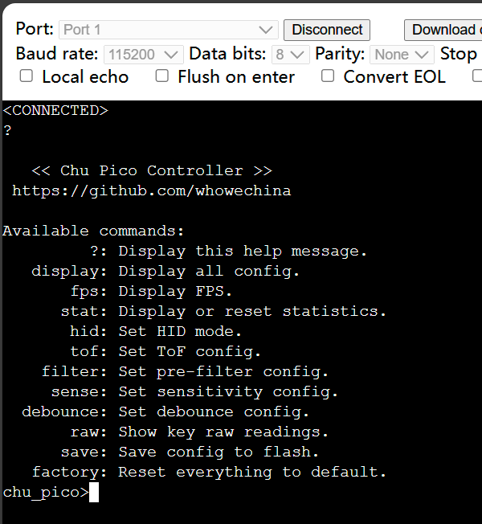

## CAD Source File
I'm using OnShape free subscription. It's powerful but it can't archive original designs to local, so I can only share the link here. STL/DXF/DWG files are exported from this online document.  
https://cad.onshape.com/documents/8b9d0fe6ff1bfa4da17d33ee/w/5c7c980a282a19e7ba1db795/e/56ee65492584a3f709c23c49?renderMode=1&uiState=64fd606f17393c0e6f9b19a4
