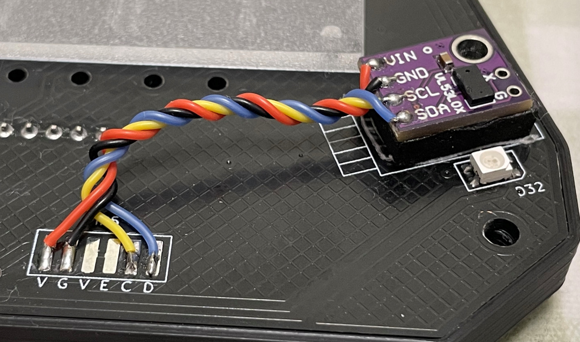
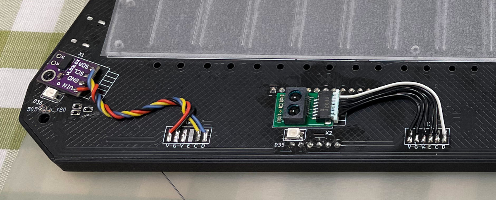
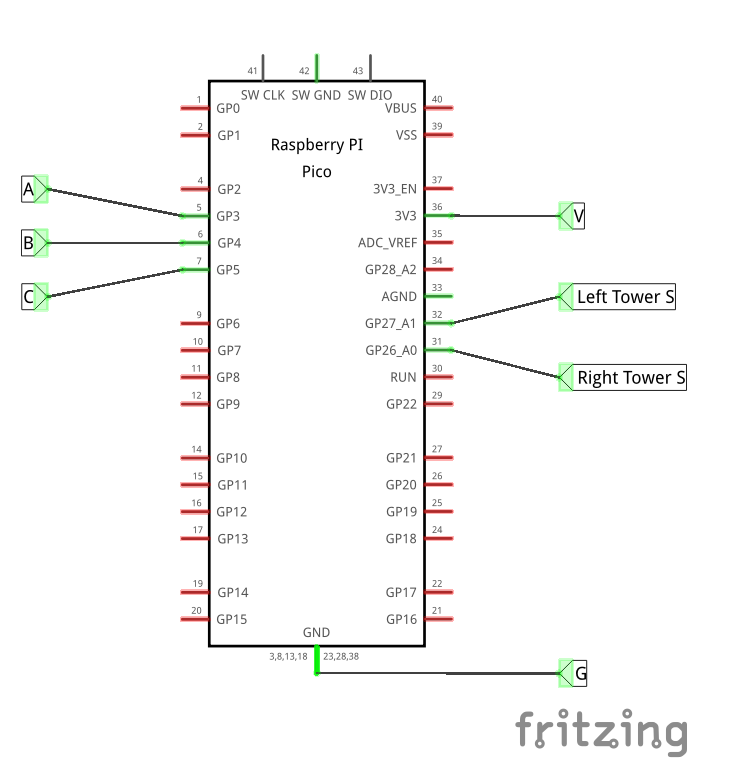
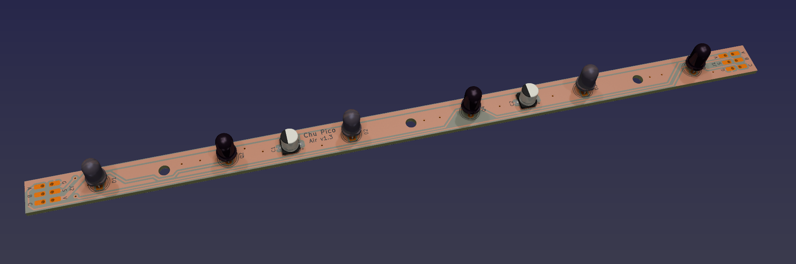

# Chu Pico - Chunithm (中二节奏) 风格的迷你控制器
[Click here for the English version of this guide.](README.md)

**特性:**
* 它很小巧，适合15-17寸屏幕。
* 空键被 ToF 距离传感器替代。
* 也提供了传统 IR Air 的机制供 DIY 玩家使用。
* HID 灯光，必须的！
* 32个按键（上下两排）。
* 遵循 CrazyRedMachine 的 RedBoard I/O 协议。
* 丰富的命令行功能。
* 所有源文件开放。

感谢许多尊敬的爱好者和公司将他们的工具或材料免费或开源（KiCad，OnShape，InkScape，Raspberry 相关工具, 嘉立创）。

感谢社区开发者的启发和帮助，比如 CrazyRedMachine (https://github.com/CrazyRedMachine)，SpeedyPotato (https://github.com/speedypotato).

还有：
* RP_Silicon_KiCad: https://github.com/HeadBoffin/RP_Silicon_KiCad
* Type-C: https://github.com/ai03-2725/Type-C.pretty

## 注意
这个项目相比于我其他项目（比如 IIDX Pico 和 IIDX Teeny）其实是要容易一些的。你也可以尝试做我其他的一些项目。

## 关于许可证
它是 CC-NC 授权。所以你只能给自己和你的朋友 DIY，不能利用这个项目赚钱，比如收费的代做，出售整机等，连源作者都不敢提的抄袭或者稍微改改换个名字来打擦边球就更不可以了。注意团购和拼单订购原始元器件是合理的，非盈利的方式卖掉剩余的元器件也是可以接受的。

如果希望找我购买成品或者寻求商用授权，请联系我（Discord，QQ 群，闲鱼，微信群或者在 issue 区留下你的联系方式）。

## 我的 Discord 服务器邀请
https://discord.gg/M8f2PPQFEA

## 其他项目
你也可以查看我其他的酷炫项目。

             

* Popn Pico: https://github.com/whowechina/popn_pico
* IIDX Pico: https://github.com/whowechina/iidx_pico
* IIDX Teeny: https://github.com/whowechina/iidx_teeny
* Chu Pico: https://github.com/whowechina/chu_pico
* Mai Pico: https://github.com/whowechina/mai_pico
* Diva Pico: https://github.com/whowechina/diva_pico
* AIC Pico: https://github.com/whowechina/aic_pico
* Groove Pico: https://github.com/whowechina/groove_pico
* Geki Pico: https://github.com/whowechina/geki_pico
* Musec Pico: https://github.com/whowechina/musec_pico
* Ju Pico: https://github.com/whowechina/ju_pico
* Bishi Pico: https://github.com/whowechina/bishi_pico
* Nos Pico: https://github.com/whowechina/nos_pico

## **声明** ##
我在个人时间内制作了这个项目，没有任何赞助。我将继续改进这个项目。我已尽我所能确保所有内容的准确性和功能性，但总有可能出现错误。如果你因使用这个开源项目而造成时间或金钱的损失，我不能负责。感谢你的理解。

## 如何制作
### 常见错误
很多 DIY 爱好者在制作过程中常常犯一些错误。请格外小心避免这些错误。
* **错误：在焊接之前没有进行中间测试。**  
  请记住，即使是专业工程师也会犯错误。当所有元件都已组装或焊接时，要找到问题的根本原因就会变得更加困难。因此，建议分阶段焊接和测试。固件设计为即使有一些元件缺失也能正确运行，这对测试很有帮助。
* **错误：忘记切断 MPR121 模块上的 ADDR 引脚的默认接地。**  
  市面上的 MPR121 模块的 ADDR 引脚默认已经接地。但是，板子上的设计需要一个浮动的 ADDR 引脚，否则 ADDR 引脚会短路。请使用万用表验证确保你成功切断它，但也请注意不要切过头，导致切断临近线路。
* **错误：在器件看上去没有工作的时候就匆忙更换它。**  
  比如过早的假设 Raspberry Pi Pico 或其他模块是有问题的。
  请记住，器件绝大部分情况下都是好的，问题可能在焊接上。更换器件会带来额外的风险，比如损坏器件或 PCB 板。耐心和谨慎是至关重要的。首先查看原理图和 PCB 设计文件，并向社区寻求帮助。怀疑器件问题应该是你的最后选择。
* **错误：没有正确焊接 Raspberry Pi Pico 的 2 个 USB 引脚。**  
  这 2 个引脚位于 PCB 板的底部。很容易忘记焊接它们，或者在焊接过程中留下气泡。为了避免这种情况，从孔的一侧开始慢慢焊接，使用很少的焊丝和较多的焊剂。

### PCB
* 前往 JLCPCB 下单，使用最新的 `Production\PCB\chu_main_xxx.zip` 文件，选择常规 FR-4 板材，黑色，厚度为 **1.6mm**。
* 1x 树莓派 Pico 或 Pico W。  
  https://www.raspberrypi.com/products/raspberry-pi-pico
  注意 PCB 板的底部有 3 个引脚，它们很难焊接，可能会留下气泡。  
  

* 1x USB Type-C 插座 (918-418K2023S40001 或 KH-TYPE-C-16P)
* 36x WS2812B-4020 侧向发光 RGB LED。  
  https://www.lcsc.com/product-detail/Light-Emitting-Diodes-LED_Worldsemi-WS2812B-4020_C965557.html

* 1x TCA9548APWR (TSSOP-24) I2C 多路复用芯片。  
  https://www.lcsc.com/product-detail/Signal-Switches-Encoders-Decoders-Multiplexers_Texas-Instruments-TCA9548APWR_C130026.html

* 3x MPR121 模块，市面上有很多种，选择这种类型的。  
  https://www.sparkfun.com/products/retired/9695  
  在焊接 MPR121 模块到主 PCB 板之前，记得用小刀**切断 ADDR 和 GND 之间的微小连线**，注意绝对不要切过头。  
    
  MPR121 模块加上引脚的高度超过了 PCB 板的高度。所以你需要像下面的图片一样焊接模块。  
  首先贴上一些绝缘胶带。  
    
  然后直接将模块焊接到 PCB 上。  
    
  你可以使用模块自带的引脚，但是你需要剪掉塑料垫。  
  

* 5x Sharp GP2Y0E03 或 ST VL53L0X ToF 传感器模块，你还需要一些排线。注意下面这些照片是在早期版本 PCB 上拍的，上面的 LED 已经被更换为侧面出光的型号。  
  https://www.lcsc.com/product-detail/Angle-Linear-Position-Sensors_Sharp-Microelectronics-GP2Y0E03_C920270.html  
    
    
  你可以在同一个 PCB 上同时使用这两种传感器，固件会自动识别它们。
  
* 12x 0603 5.1kohm 电阻 (R1, R2)，用于 PCB 上所有电阻。
* 8x 0603 1uF (0.1~1uF 都可以) 电容 (C1 to C8)，可选，建议使用。
* 3x 松下 EVQP46B3M 超小微动开关。  
  https://industry.panasonic.com/global/en/products/control/switch/light-touch/number/evqp46b3m

### 导光板
* 找到一个服务商，使用 DXF 或 DWG 文件 `Production\CAD\chu_pico_lgp.*` 切割导光板，尺寸为 256mm*60mm，厚度为 1.8mm 到 2.0mm，越薄越好。2.0mm 的很容易找到，1.8mm 的很少见。我用的是 1.8mm 的。
  
* 导光板材料的选择：
  * 真正的 LGP 材料，是最好的选择。  
    
  * 透明亚克力板 + 导光膜，也是一个不错的选择。  
    
  * 单面磨砂透明亚克力，也可以。  
    
  * 透明亚克力 + 手工单面磨砂，也马马虎虎。  
    

### 面板膜
* 一个自粘的**纹理**/**磨砂**膜，它被贴在导光板的顶部表面。它改善了触感。你可以使用窗贴膜。它**必须**是自粘的，**不可以是**静电膜。它们通常很便宜。
* 将膜剪裁成与导光板相匹配的形状，然后粘贴到导光板上。  
  
* 轻轻地擦拭膜，以去除任何气泡并使其和导光板紧密贴合。  
  

### 透红外盖板
* 它的存在是为了美观，可以遮住 5 个 ToF 传感器。  
  
* 它必须是 "红外透射亚克力板"，它可以遮住可见光，但可以让红外光穿透。  
  
* 找到一个服务商，使用 DXF 或 DWG 文件 `Production\CAD\chu_pico_ir_cover.*` 切割红外盖板，尺寸为 293.2mm*63.5mm，厚度为 1mm。材料必须是 "红外透射亚克力板"。
  
* 如果你找不到这种材料，可以使用普通的透明亚克力，但是它不能遮住 ToF 传感器，这样看起来不太好看。
* 如果你使用 VL53L0x ToF 传感器，请在传感器下方添加一些垫片。这样可以让它贴紧亚克力盖板，可以防止光线串扰。

### 3D 打印
* 你需要一个 Bambu 3D 打印机，有两个原因：
  * 部件被设计成完美适合它的 256mm*256mm 打印床。
  * 它的 AMS 系统非常适合易于去除的支撑材料。

* 对于以下所有的打印：
  * 为了使对象适合于打印床，Z 旋转：315 度，X, Y 移动到：134mm  
      
    
  * PLA, PETG, ABS 都可以。  
  * 层高：0.2mm
  * 壁厚：4-6层，50%+ 填充
  * 支撑：没有明确说明，则不需要。

* 基座：`Production\3D\chu_pico_base.stl`，深灰色，需要支撑来让螺丝孔更好一点。
* 盖板：`Production\3D\chu_pico_cover(_aime).stl`，深灰色，上下颠倒打印。
* 盖板底座：`Production\3D\chu_pico_cover_base.stl`，**透明**（重要）。
* 导光板固定器：`Production\3D\chu_pico_lgp_fixer.stl`，颜色无所谓。

### 组装爆炸图

由上到下：
* 透红外盖板
* 盖板
* 盖板底座
* 面板膜
* 导光板
* PCB
* 导光板固定器
* 基座

你需要 **4x M3*12mm 螺丝和 4x M3 六角螺母** 来固定所有东西。

7x 个硅胶防滑垫可以贴在基座的底部，以提供游玩时候的稳定性。

### 红外空键
Chu Pico 本身不需要红外空键。但是有些人可能用 Chu Pico 来做一个全尺寸的控制器，它们更喜欢传统的 IR 空键。
所以我提供了 IR 空键的设计，包括一对空键 PCB 和对应的固件支持。
1. 首先，你需要下单 PCB，Gerber 文件在 `Production\PCB\chu_air_v*.zip`。空键的两侧都需要这个 PCB。
2. 根据原理图里的有标记，购买对应的元器件，然后按照丝印焊接到 PCB 上。
3. 左侧传感器 PCB 使用 J1 连接到 Pi Pico 主控，右侧传感器 PCB 使用 J2 连接。GPIO 3 -> A, GPIO 4 -> B, GPIO 5 -> C, ADC 0 (GPIO 26) -> Right S, ADC 1 (GPIO 27) -> Left S。  
   

4. 调试上线的过程如下：
   * 在固件中启用 IR 空键（命令 `ir enable`），它会自动禁用 ToF。
   * 启用 IR 的诊断功能（命令 `ir diagnostic`）。
   * 注意 PCB 的方向：左侧 PCB，J1 在最下方，右侧 PCB，J2 在最下方（上下颠倒）。
   * 摆放两侧的空键塔，观察诊断输出，数值高代表着对应的红外光线已经对准接收器。
   * 在正确摆放好空键塔后，设置基线（命令 `ir baseline`）。
   * 可选，设置触发灵敏度，它用一个变化的百分比值来表达（命令 `ir trigger <1..100>`）。

### 固件
* UF2 文件在 `Production\Firmware` 文件夹下。
* 全新烧录的话，按住 Pico Pi 的 BOOTSEL 按钮，然后连接 USB 到 PC，会出现一个名为 "RPI-RP2" 的磁盘。将 UF2 固件二进制文件拖入即可。Chu Pico 的底部有一个小孔，它正对着 BOOTSEL 按钮。
* 固件采用了 CrazyRedMachine 的 RedBoard 协议和 PC 通讯。具体请查看他的项目（别忘了给他点赞并访问他的 GitHub 查看其他酷炫的项目）：
https://github.com/CrazyRedMachine/RedBoard
* 它有一个命令行进行配置。你可以使用这个 Web 串口终端连接到 Chu Pico 的 USB 串口。（提醒："?" 命令可以查看帮助）  
  https://googlechromelabs.github.io/serial-terminal/  
  

## CAD 源文件
我使用的是 OnShape 的免费订阅。它很强大，但是它不能将原始设计存档到本地，所以我只能在这里分享链接。STL/DXF/DWG 文件是从这个在线文档导出的。
https://cad.onshape.com/documents/8b9d0fe6ff1bfa4da17d33ee/w/5c7c980a282a19e7ba1db795/e/56ee65492584a3f709c23c49?renderMode=1&uiState=64fd606f17393c0e6f9b19a4
